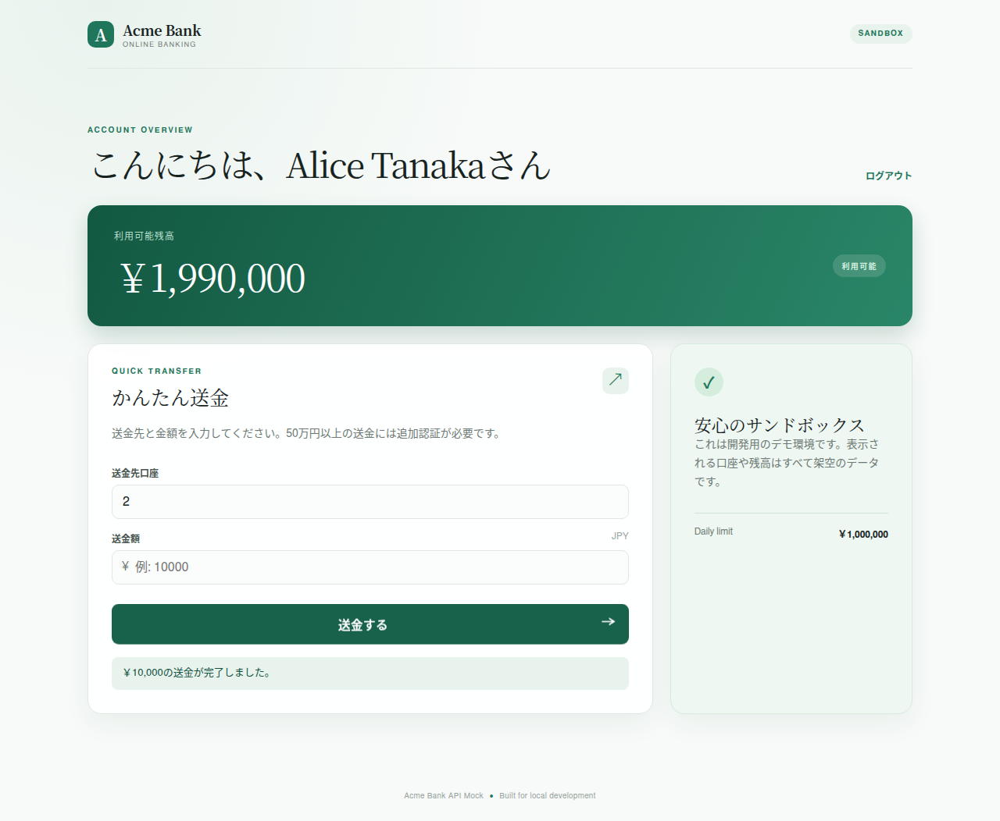

# Acme Bank API

A backend service for Acme Bank's online banking platform. It exposes
accounts, money transfers, authentication, and notifications behind a small
REST API.

## Features

- Account lookup (balance, frozen status, daily transfer limit)
- Money transfers between accounts, with validation for balance, account
  state, daily limits, and step-up authentication on large transfers
- Mock authentication (login + step-up verification) for exercising the
  transfer flow locally
- In-memory notification events on successful transfers

## Tech stack

- Python 3.12+
- FastAPI
- SQLite (in-memory)
- pytest / pytest-cov

## Local setup

```bash
pip install -e ".[dev]"
```

## Running the API

```bash
uvicorn app.main:app --reload
```

The local web UI is available at `http://127.0.0.1:8000/`. It provides a
small login, account overview, and transfer flow backed by the same API.

### Dashboard overview

After login, the dashboard gives the account owner a focused view of their
available balance, account status, daily transfer limit, and quick transfer
form. Successful transfers refresh the balance and show an in-context
confirmation message. The UI is intentionally small and sandbox-oriented,
making it useful for trying the API flow locally without a separate frontend
build.



The service seeds a handful of fictional accounts on startup (see
`app/database.py`), so you can start making requests immediately:

```bash
curl http://127.0.0.1:8000/accounts/1
```

Interactive API docs are available at `http://127.0.0.1:8000/docs` once the
server is running.

## Running tests

```bash
pytest
```

With coverage:

```bash
pytest --cov=app
```

Browser E2E tests:

```bash
python -m playwright install chromium
pytest tests/e2e
```

Set `E2E_HEADFUL=1` to run the browser test with a visible browser window.
Each run writes screenshots and browser videos under `test-results/ui/`.
Set `E2E_ARTIFACTS_DIR` to change the output directory.

## Architecture

The application is organized by domain:

- `app/accounts` — account records and balance mutation
- `app/auth` — login and step-up authentication (mock)
- `app/transfers` — transfer validation and execution; the core business
  logic of the service
- `app/notifications` — in-memory notification events

See `docs/architecture.md` for more detail and `docs/business-rules.md` for
the rules governing transfers.

## Data

The service uses an in-memory SQLite database seeded with fictional sample
accounts. No real customer data, credentials, or external services are
involved.

これはテストでぬ
